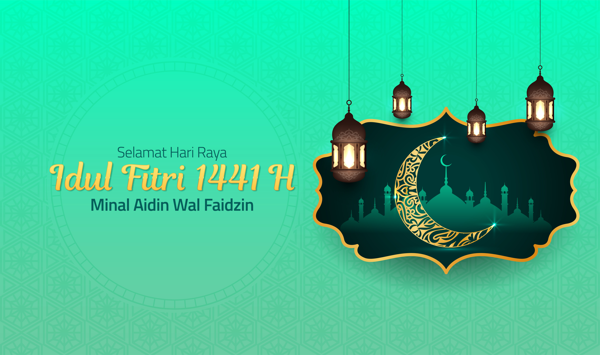

Hai semua, sebelum kalian lanjut membaca saya ucapkan Selamat Hari Raya Idul Fitri 1441 H. Semoga dari menjalankan ibadah puasa Ramadhan selama sebulan, kita dapat menjadi pribadi yang lebih baik.

>Tak ada program yang bebas dari bug, tak ada server yang selalu sehat, seperti itulah aku. Dan tak ada kata yang indah selain meminta maaf.  Selamat hari raya Idul Fitri, Taqaballahu minna wa minkum. Minal aidzin wal faidzin, mohon maaf lahir batin.

Idul Fitri selalu jadi momentum yang tak biasa, hari paling istimewa dalam rentang satu warsa. Segala keterbatasan bisa ditrobos demi lebaran. Yang tak terjangkaupun niscasa selalu diusahakan. Demi merayakan kemenangan yang menggembirakan, bersuka ria dalam bahagia yang membebaskan, namun lebaran tahun ini terasa lain sekali. Segala perayaan tertahan karena pandemi. Kebahagiaan apa yang bisa dirayakan saat krisis? mungkinkah lebaran masih memuat hal-hal yang manis?

Hari ini 24 Mei 2020 Umat Islam di seluruh dunia sedang merayakan Idul Fitri. Gara-gara corona lebaran tahun ini dirayakan tidak seperti biasanya. Dari pelarangan mudik hingga mereka yang harus merelakan tradisi Idul Fitri karena berjibaku bertugas ditengah pandemi.

Pandemi tak hanya merombak kehidupan sehari-hari, bahkan menjungkirbalikkan saat-saat paling Fitri. Tidak pernah terbayangkan berlebaran dengan berjauhan. Kemenangan yang tak dirayakan terasa macam kekalahan. Namun memaksakan kehendak bukan sekadar berbahaya, juga tak sejalan ajaran menahan diri saat puasa. Zaman penuh wabah, momentum belajar untuk tawakal, saatnya berserah total kepada Tuhan Yang Maha Awal. Sembari gigih berusaha dengan segala daya, bertahan sekuatnya dengan solidaritas warga. Penuh disiplin di masa pandemi bukanlah kesia-siaan, itulah cara terbaik untuk menyongsong kemenangan. Agar masih bisa bersua dengan Ramadhan berikutnya, mari hayati lebaran tahun ini dengan sederhana.

Kalimat di atas saya kutip dari Najwa Shihab. Mari kita berdoa bersama agar pandemi ini segera berakhir dan kita semua bisa kembali berkumpul dengan keluarga. Semoga kita semua masih dipertemukan dengan Ramadhan tahun depan. Terima kasih telah membaca.