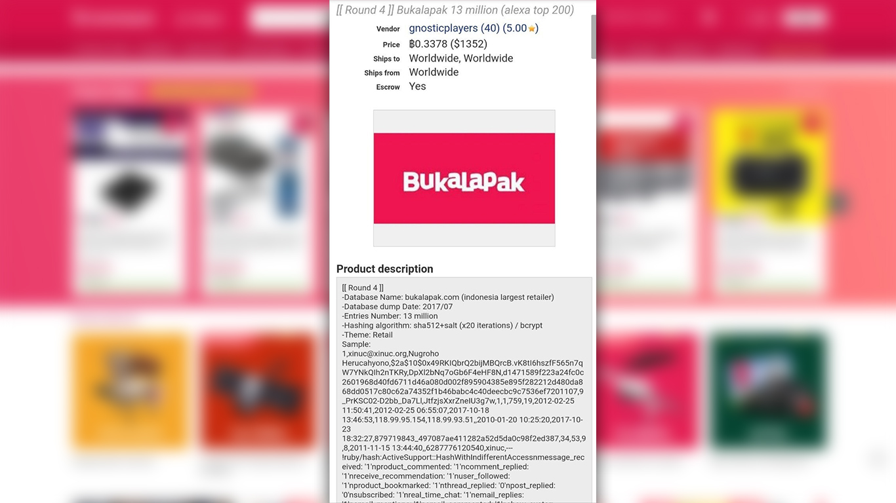
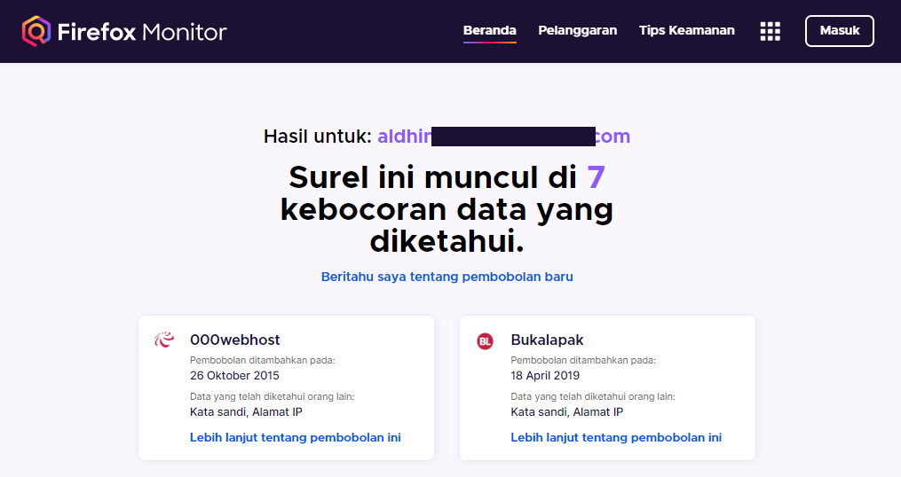

Akhir-akhir ini kita mendengar berita kebocoran data pengguna dari salah satu marketplace besar di Indonesia yaitu Tokopedia. Tidak hanya sekali saja data pengguna Indonesia terlibat dalam kejadian kebocoran data. Berikut adalah kejadian-kejadian kebocoran data yang melibatkan data-data penting. 

## 1. Bukalapak

Tahun 2019 lalu 13 juta data pengguna Bukalapak dijual seharga $1.350 atau setara 19,9 juta rupiah di dark web. Data yang bocor diantaranya adalah :
- Nama lengkap
- Email
- Username
- Password hash
- IP Address
- dll

## 2. Lion Group

Setelah itu ada kejadian yang menimpa Lion Group (Malindo Air dan Thai Lion), 7,8 juta data pengguna bocor dan turut melibatkan 156 ribu data WNI. Data yang bocor diantaranya adalah :
- Nama lengkap
- DOB
- Nomor HP
- Pasport No & Exp
- ID Card No & Exp
- dll

## 3. Tokopedia

Kemudian baru-baru ini kita dikejutkan dengan kejadian kebocoran 91 juta data pengguna Tokopedia. Informasi mengenai Tokopedia yang kebobolan, total data yang bocor adalah 91 juta data pengguna, bukan cuma 15 juta. Saat itu data dijual bebas di Empire Market dengan harga $5.000 atau sekitar 74 juta rupiah. Data yang dipastikan bocor : 
- Nama lengkap
- Email
- Nomor HP
- Jenis kelamin
- Tanggal lahir

## 4. Bhinneka

Lalu ada kejadian yang melibatkan Bhinneka, total data yang bocor adalah 1,2 juta data pengguna dan dijual seharga $1.200 di dark web. Data yang bocor diantaranya adalah :
- Nama lengkap
- Email
- Nomor hp
- Password hash
- Gender
- dll

## 5. Komisi Pemilihan Umum

Setelah itu ada kejadian yang tak kalah mengejutkan akibat kelalaian KPU, 200 juta data DPT bocor. Semuanya bocor tanpa sensor sedikitpun. Untuk data penduduk yang bocor, yang baru dirilis adalah data 2.3 juta penduduk DIY (Daerah Istimewa Yogyakarta). Diantaranya adalah kota/kabupaten Bantul, Gunung Kidul, Kota, Kulon Progo & Sleman. 

Bisa dipastikan data ini bocor dari KPU, entah itu KPUD ataupun KPU Pusat. Isi datanya adalah sekumpulan DPT (Daftar Pemilh Tetap) dari semua TPS (Tempat Pemungutan Suara). Data yang bocor termasuk :
- Nama Lengkap
- NIK
- KK
- Tempat & tanggal lahir
- Umur
- Jenis Kelamin
- Status perkawinan
- Alamat Lengkap.

Semua data tersebut tersedia dalam bentuk PDF yang sudah disortir berdasarkan TPS. Walaupun data yang baru dirilis hanya 2.3 juta data, namun pelaku yang membocorkan data tersebut mengklaim dia memiliki lebih dari 200 juta data, itu artinya data seluruh DPT yang ada di Indonesia.

## 6. Universitas Indonesia

Selanjutnya yang menimpa Universitas Indonesia. Lebih tepatnya adalah website Fakultas Ilmu Komputer UI dan juga MRU Fakultas Kedokteran UI dibobol dan datanya dibocorkan. Berikut untuk sample data yang sudah dibocorkan :

## 7. Kementerian Pendidikan dan Kebudayaan

Kemdikbud juga mengalami kejadian serupa, 1.3 juta data  bocor. Data yang dibocorkan diantaranya adalah :
- NIK
- Nama lengkap
- Tempat & tanggal lahir
- Status pernikahan
- Nama lengkap ibu
- Nama lengkap ayah
- No KK
- Alamat lengkap
- dll

Di atas adalah 7 kejadian kasus kebocoran data yang melibatkan Indonesia. Semua informasi di atas saya ambil dari Teguh Aprianto <a href="https://twitter.com/secgron" target="_blank" rel="noreferrer" title="@secgron">@secgron</a> *(Security Consultant untuk suatu perusahaan di Jakarta. Juga merupakan Co-founder dan Kontributor di Komunitas Ethical Hacker Indonesia)*.

Website untuk cek apakah email kalian bocor atau tidak: <a href="https://monitor.firefox.com/" target="_blank" rel="noreferrer" title="Firefox Monitor">monitor.firefox.com</a>. Firefox Monitor adalah layanan online yang dikembangkan oleh Mozilla, diumumkan pada Juni 2018 dan diluncurkan pada 25 September 2018. Masukkan email kalian lalu akan muncul list website dimana email kalian ada di dalamnya saat kejadian kebocoran data terjadi. Akan muncul tanggal kejadiannya juga.

Sekian informasi yang bisa saya bagikan. Silahkan bagikan artikel diatas ke teman-teman kalian. Dan tetap jaga data kalian seaman mungkin.