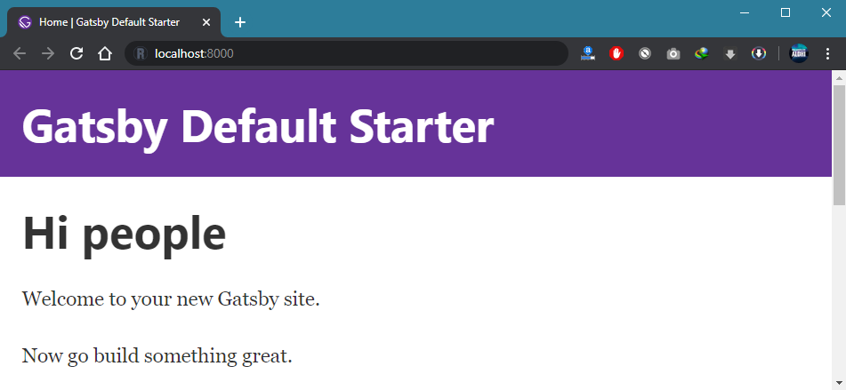

Hi semua!

Sebuah blog sangat penting bagi saya. Beberapa blog yang saya buat menggunakan platform Blogger dan Wordpress, dulu juga pernah buat menggunakan 2 framework php terkenal yaitu Codeigniter dan juga Laravel. Nah, pas banget sekarang sedang di rumah aja karena pandemi corona tak kunjung selesai, saya iseng ubah blog profile saya yang sebelumnya menggunakan CI menjadi GatsbyJS, ya itung-itung sambil belajar. Menurut saya seorang mahasiswa di jurusan Teknik Informatika wajib banget punya minimal 1 website, lebih baik lagi jika punya domain berbayar dan juga hosting tentunya.

Oke di sini mari kita membahas gimana caraku bikin blog pakai si GatsbyJS ini. Mulai dari install GatsbyCLI sampai upload web kita ke hosting cPanel ataupun ke penyedia host gratis.

### Install GatsbyJS

Yang pertama pastikan sudah install Node JS atau NPM di PC atau laptop kalian, untuk mengeceknya bisa dengan ketik perintah di bawah di command prompt atau CMD atau terminal di IDE yang kalian pakai:

```jsx
node -v
```

Kalau versi Node JS nya muncul artinya sudah terinstall. Selanjutkan kalian bisa ketik perintah di bawah untuk menginstall Gatsby CLI.

```jsx
npm install gatsby-cli
```

Setelah proses install berhasil, selanjutnya silahkan buat project Gatsby baru dengan ketik perintah di bawah.

```jsx
gatsby new belajar-gatsby
```

<code>belajar-gatsby</code> adalah penamaan folder yang akan dibuat, jadi silahkan ubah sesuai selera kalian.

Setelah instalasi selesai silahkan masuk ke direktori yang telah dibuat, dengan cara manual masuk melalui windows explorer atau langsung ketik perintah di bawah jika kalian masih membuka jendela terminal yang tadi.

```jsx
cd belajar-gatsby
```

Setelah masuk ke folder project kalian, langsung saja ketik perintah di bawah untuk menjalankan server Gatsbynya.

```jsx
gatsby develop
```

Setelah itu silahkan buka aplikasi browser dan buka alamat <code>http://localhost:8000</code>. Maka akan muncul web dengan tampilan seperti di bawah.



Setelah itu kalian bisa melanjutkan dengan mengedit dan mengubah tampilan dan isi sesuai dengan selera kalian masing-masing.

### Cara Upload ke Hosting cPanel

*Tunggu update selanjutnya :)*

### Membuat Blog Sederhana dengan GatsbyJS

*Tunggu update selanjutnya :)*